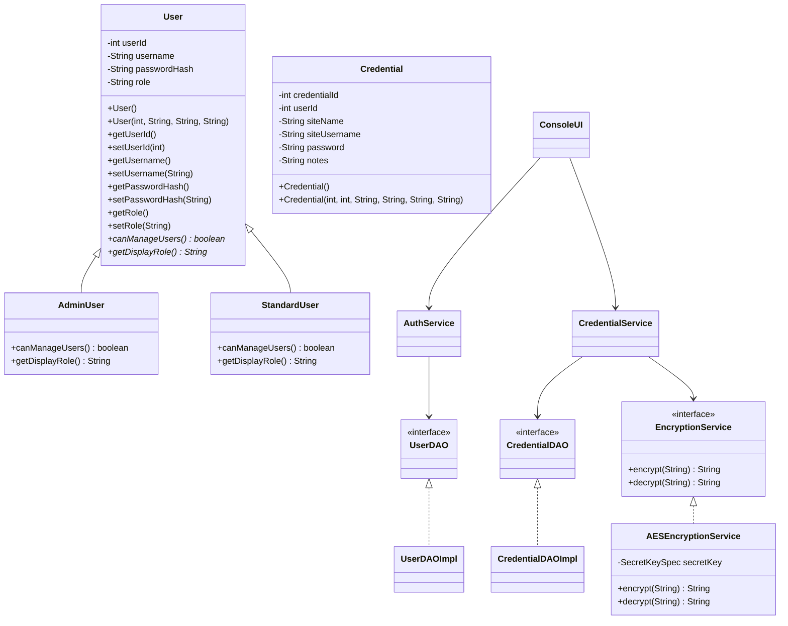

# Class Diagram

```mermaid
classDiagram
    class User {
        -int userId
        -String username
        -String passwordHash
        -String role
        +User()
        +User(int, String, String, String)
        +getUserId()
        +setUserId(int)
        +getUsername()
        +setUsername(String)
        +getPasswordHash()
        +setPasswordHash(String)
        +getRole()
        +setRole(String)
        +canManageUsers()* boolean
        +getDisplayRole()* String
    }

    class AdminUser {
        +canManageUsers() boolean
        +getDisplayRole() String
    }

    class StandardUser {
        +canManageUsers() boolean
        +getDisplayRole() String
    }

    class Credential {
        -int credentialId
        -int userId
        -String siteName
        -String siteUsername
        -String password
        -String notes
        +Credential()
        +Credential(int, int, String, String, String, String)
    }

    class EncryptionService {
        <<interface>>
        +encrypt(String) String
        +decrypt(String) String
    }

    class AESEncryptionService {
        -SecretKeySpec secretKey
        +encrypt(String) String
        +decrypt(String) String
    }

    class UserDAO {
        <<interface>>
    }

    class CredentialDAO {
        <<interface>>
    }

    class UserDAOImpl
    class CredentialDAOImpl
    class AuthService
    class CredentialService
    class ConsoleUI

    User <|-- AdminUser
    User <|-- StandardUser
    EncryptionService <|.. AESEncryptionService
    UserDAO <|.. UserDAOImpl
    CredentialDAO <|.. CredentialDAOImpl
    AuthService --> UserDAO
    CredentialService --> CredentialDAO
    CredentialService --> EncryptionService
    ConsoleUI --> AuthService
    ConsoleUI --> CredentialService
```
